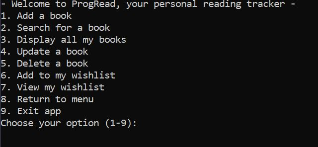
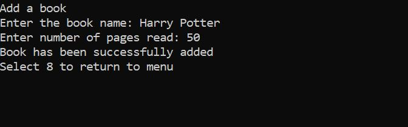
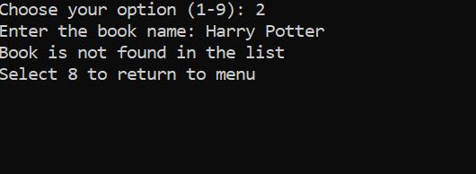
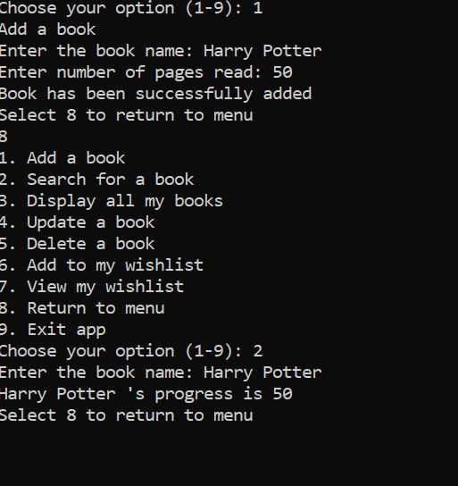
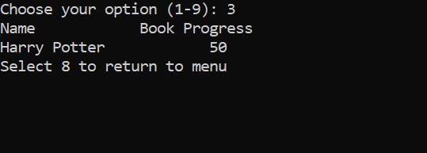
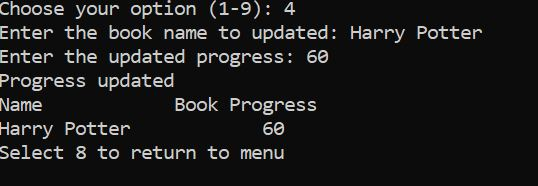
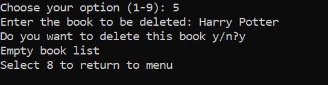
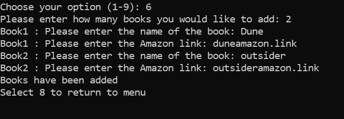
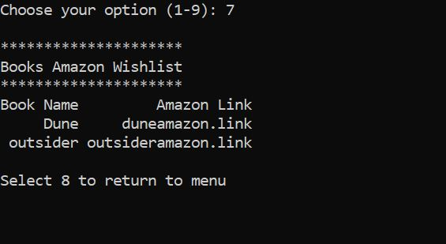

# Progread
## App for all your reading tracker needs
Progread is designed for avid readers who often find themselves losing track of which books they are currently reading and how far they've progressed. This is a simple and easy to use app which will allow them to note down their progress and even save which books they're wishing to read in the future. 

**Name:** Samiira Osman

**Repository Link:**

**Presentation link:**

## Features

The features which are present in this app include: 

_**- Add a book**_

This feature users readers to add books that they have begun reading as well as how far they've progressed into the book. 

_**- Search for a book**_

This feature allows for users to search for a book that they've added to their list so that they can see how far they've progressed into this book. 

_**- Display all books**_

This feature allows for users to see a list of all the books that they have added

_**- Update a book**_

This feature allows users to update their progress on a book which is currently in their list

_**- Delete a book**_

This feature allows users to delete a book from their list (i.e. if they've finished reading the book)

_**- Add to my wishlist/view my wishlist**_ 

These are additional features which allow users to add in any books that they are hoping to read in the future, by adding the name of the book along with the amazon link to purchase the book. They can also view all the books currently in their wishlist. 

## Implementation plan

## Instructions 

**How to open the app:**

- Install python3
- Check that the terminal is in the appropriate directory to run the app
- Use command: 
``` .\run_mainpy.bat ```
- App will automatically open and can commence use of features. 

**How to use the features:**



Once the main menu has been opened, select an option to proceed. 

_Option 1:_

Once you've selected 1, the following should appear: 



- Enter both the book name and number of pages
- Once the message reads "book has been successfully added" then hit **8** to return back to the menu 

_Option 2:_

**2** allows you to search for a book. If you haven't added any books to the list, the following will appear: 



However, once you've added a book to the list, the following will appear: 



_Option 3:_

**3** allows you to view all the books you've added so far: 



_Option 4:_

This features allows you to update a book that is currently on your reading list to reflect the progress you have made. 

Once you enter which book to update, hit enter and the change will be reflected in the list. 



_Option 5:_

This features allows you to delete a book from the list. 
Once you've selected **5**, you enter the name of the book you wish to delete. 

Then a confirmation should appear: select **y** if you wish to delete this book followed by enter. 

If this was the only book on your list the list will now show up as empty. 



_Option 6&7:_

These are the wishlist features of the app. In order to add an item to the wishlist, first enter option **6**. 

The app will then ask how many books you wish to add to the wishlist, followed by asking for the name and link to the amazon page to purchase this book.

After this, hit enter and the books have been added to the list.



Once you've added a book, select option **7** to view these books in your wishlist: 




## Manual Testing 


